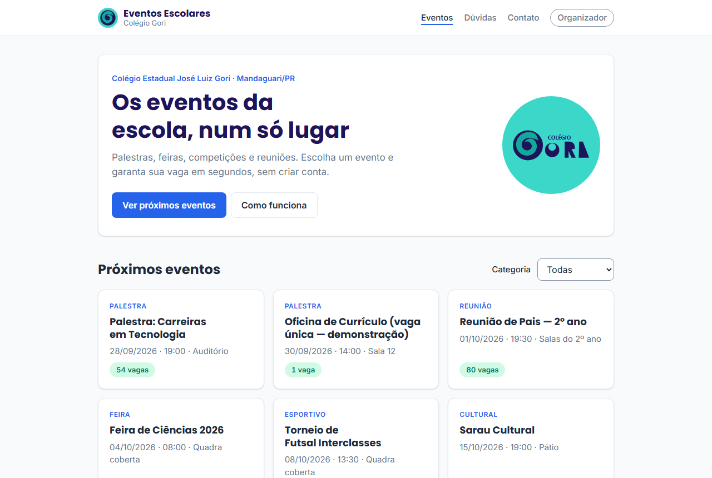
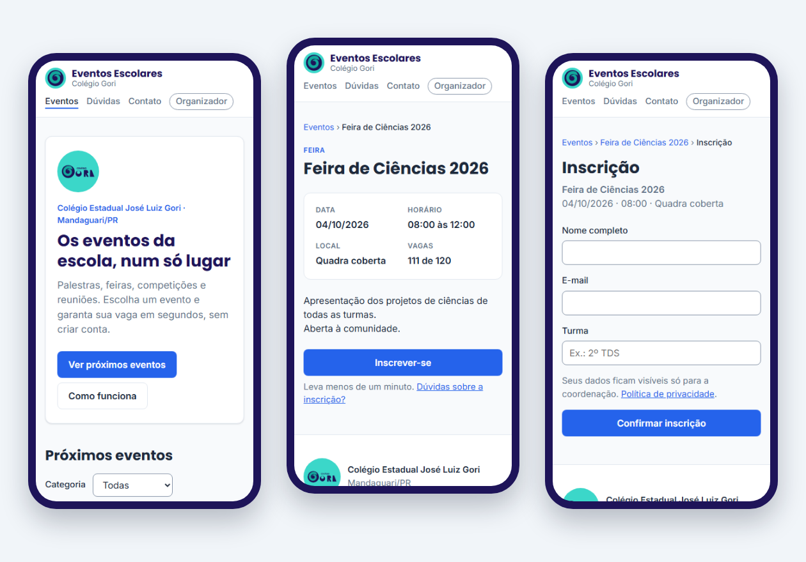
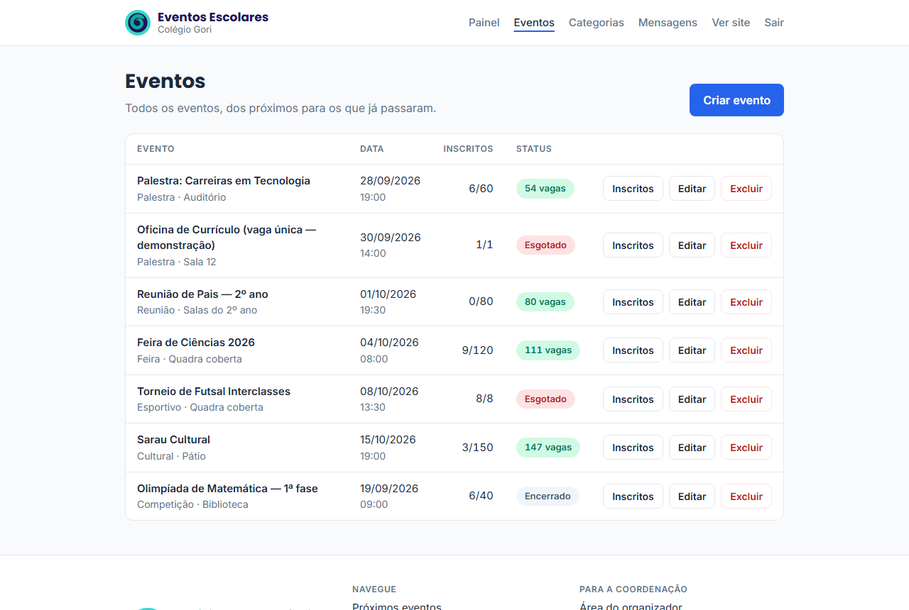
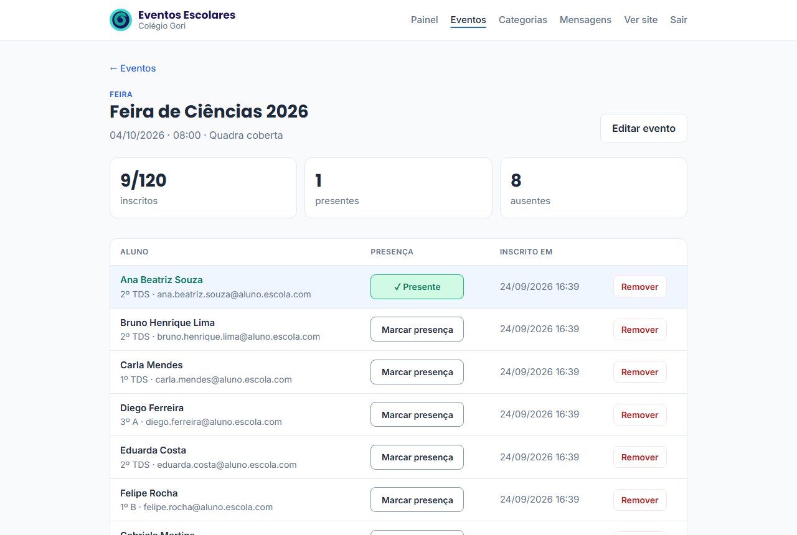
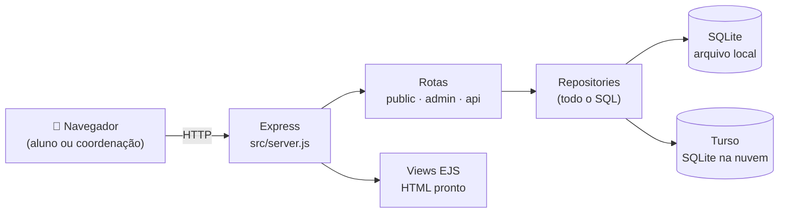
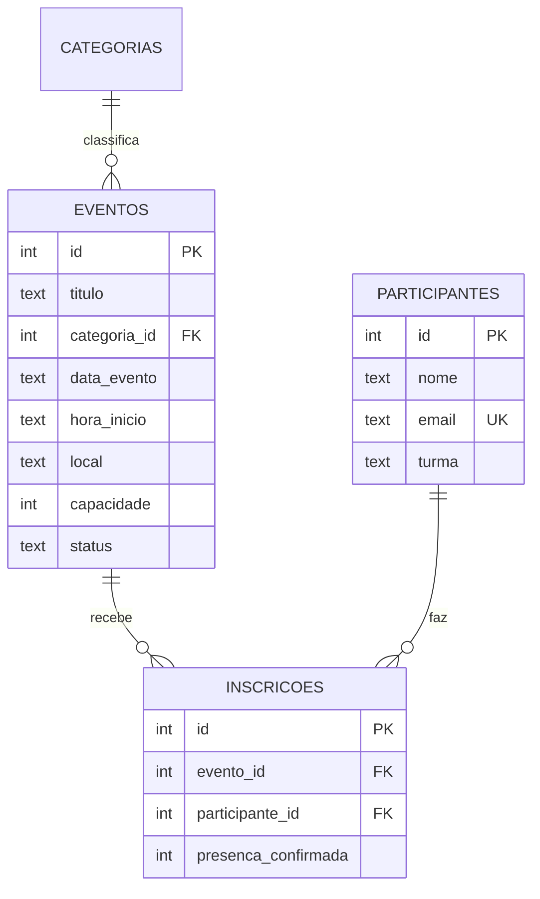

<div align="center">


<br>


**Os eventos da escola num só lugar: o aluno se inscreve em segundos, sem criar conta,<br>e a coordenação sabe exatamente quem vai e quem compareceu.**

[Ver demonstração](#-demonstração) · [Funcionalidades](#-funcionalidades) · [Rodar no computador](#-rodar-no-seu-computador) · [Colocar no ar](#-colocar-no-ar-vercel--turso) · [Documentação](#-documentação)

</div>

---

## 💡 O problema

Feiras, palestras, reuniões de pais e competições do **Colégio Estadual José Luiz Gori** eram divulgadas no mural, em grupos de WhatsApp e no boca a boca. Resultado: aluno que nem sabia do evento, evento lotando além da conta (ou vazio) e nenhum registro de quem compareceu.

**A solução:** um site onde a escola publica eventos com vagas limitadas, o aluno se inscreve pelo celular em menos de um minuto e a coordenação faz a chamada no dia com um clique.

## 🎬 Demonstração

<div align="center">
  
  <p><sub>Inscrição → vaga esgotada em tempo real → check-in de presença pela coordenação</sub></p>
</div>

## ✨ Funcionalidades

<table>
<tr>
<td width="50%" valign="top">

### 🎓 Para o aluno
- Lista dos próximos eventos, com **vagas restantes**
- Filtro por categoria (palestra, feira, esportivo…)
- Inscrição com **nome, e-mail e turma** — sem senha
- Página de agradecimento com o resumo do evento
- Perguntas frequentes e página de contato
- Funciona bem no celular (a partir de 360 px)

</td>
<td width="50%" valign="top">

### 🏫 Para a coordenação
- Painel com resumo: eventos, inscrições, presenças
- Criar, editar, encerrar e excluir eventos
- Categorias de evento
- Lista de inscritos com **check-in em um clique**
- Remover inscrição (libera a vaga)
- Caixa de mensagens do formulário de contato

</td>
</tr>
</table>

### 🔒 Regras que o sistema garante

| Regra | Como |
|---|---|
| Vagas nunca estouram | Contagem e gravação na **mesma transação** do banco |
| Ninguém se inscreve duas vezes no mesmo evento | Checagem por e-mail + `UNIQUE` no banco |
| Evento encerrado ou que já passou não aceita inscrição | Conferido no servidor, mesmo que alguém envie o formulário direto |
| Dados dos alunos só para a coordenação | Área protegida por senha (bcrypt); a API pública não expõe e-mails (LGPD) |

## 📸 Telas

<div align="center">
  
  <br><br>
  
  <br><br>
  
  
</div>

## 🧱 Como funciona



- **O servidor monta o HTML** (EJS) — não existe front-end separado. Os formulários funcionam até sem JavaScript.
- **Nenhuma rota escreve SQL**: todo acesso ao banco passa pelos *repositories*.
- **O mesmo código** usa um arquivo SQLite no computador e o **Turso** (SQLite na nuvem) quando está na Vercel.

<details>
<summary><b>Modelo do banco de dados</b></summary>



Script completo: [`src/schema.sql`](src/schema.sql) · Detalhes: [`docs/ARCHITECTURE.md`](docs/ARCHITECTURE.md)
</details>

## 🛠️ Tecnologias

| Camada | Escolha | Por quê |
|---|---|---|
| Servidor | Node.js + Express 4 | Simples, muito documentado |
| Páginas | EJS (renderizado no servidor) | Um projeto só, formulários HTML puros |
| Banco | SQLite com `@libsql/client` | Local: arquivo. Produção: Turso. Mesmo SQL nos dois |
| Login | `bcryptjs` + `cookie-session` | Senha com hash; sessão em cookie assinado (funciona na Vercel) |
| Visual | CSS puro, sem framework | Um arquivo, fácil de explicar |
| Hospedagem | Vercel + Turso | Deploy automático a cada `git push`, dados persistentes |

## 💻 Rodar no seu computador

**Pré-requisitos:** [Node.js](https://nodejs.org) LTS e Git.

```bash
git clone https://github.com/KaioSilva14/Projeto-Integrador-2-TDS.git
cd Projeto-Integrador-2-TDS
npm install
cp .env.example .env   # abra o .env e preencha SESSION_SECRET e ADMIN_SENHA
npm run seed           # cria o banco, as categorias e o usuário organizador
npm run seed:demo      # opcional: eventos e inscrições de exemplo
npm run dev            # abre em http://localhost:3333
```

Para gerar o `SESSION_SECRET`:
```bash
node -e "console.log(require('crypto').randomBytes(32).toString('hex'))"
```

**Área do organizador:** `/admin/login`, com o `ADMIN_EMAIL` e a `ADMIN_SENHA` do seu `.env`.

| Comando | O que faz |
|---|---|
| `npm run dev` | Inicia com reinício automático ao salvar |
| `npm start` | Inicia sem reinício automático |
| `npm run seed` | Cria categorias e organizador (pode rodar várias vezes) |
| `npm run seed:demo` | Eventos e inscrições de exemplo (só com o banco vazio) |
| `npm run backup` | Salva uma cópia de todas as tabelas em `backups/` |
| `npm run copiar-banco` | Copia os dados de um banco para outro (ex.: do PC para o Turso) |

## 🚀 Colocar no ar (Vercel + Turso)

Na Vercel, o disco é apagado a cada atualização do site — um arquivo `.db` ali **perderia todos os dados**. Por isso, em produção o banco fica no **[Turso](https://turso.tech)** (SQLite na nuvem, com plano gratuito). O código já está pronto para isso: basta configurar.

**1. Criar o banco no Turso**
Na Vercel: *Storage → Create Database → Turso*. A integração cria o banco e adiciona as variáveis `TURSO_DATABASE_URL` e `TURSO_AUTH_TOKEN` ao projeto. *(Também dá para criar direto em [turso.tech](https://turso.tech) e copiar as duas variáveis.)*

**2. Importar o repositório na Vercel**
*Add New → Project →* escolher `Projeto-Integrador-2-TDS`. A Vercel reconhece o Express sozinha.

**3. Variáveis de ambiente** (*Settings → Environment Variables*)

| Variável | Valor |
|---|---|
| `TURSO_DATABASE_URL` | vem do passo 1 (`libsql://...turso.io`) |
| `TURSO_AUTH_TOKEN` | vem do passo 1 |
| `SESSION_SECRET` | texto aleatório **novo** (gere com o comando acima) |
| `SITE_URL` | endereço do site, ex.: `https://eventos-gori.vercel.app` |
| `CONTATO_EMAIL`, `CONTATO_TELEFONE`, `ESCOLA_ENDERECO` | opcionais — aparecem na página de contato |

**4. Levar os dados do seu computador para o Turso** (uma vez só)
No terminal do projeto (PowerShell), com os valores do passo 1:
```powershell
$env:TURSO_AUTH_TOKEN = "cole-o-token-aqui"
npm run copiar-banco -- --de data/eventos.db --para libsql://seu-banco.turso.io
```
Copia tudo — eventos, inscrições, categorias e o login do organizador — numa única transação. *(Para começar do zero em vez de copiar: `$env:TURSO_DATABASE_URL = "libsql://..."` e depois `npm run seed`.)*

**5. Publicar:** *Deploy*. A partir daí, cada `git push` na `main` atualiza o site sozinho.

**Backup dos dados de produção** (recomendado antes de cada apresentação):
```powershell
$env:TURSO_DATABASE_URL = "libsql://seu-banco.turso.io"; $env:TURSO_AUTH_TOKEN = "..."
npm run backup
```

## ✅ Qualidade para publicação

| | | | |
|---|---|---|---|
| ✅ Chamada para ação na 1ª seção | ✅ Mensagens de erro que dizem o que fazer | ✅ Página de contato | ✅ 5 perguntas frequentes |
| ✅ Imagens otimizadas (SVG + PNG leves) | ✅ Links internos (menu, rodapé, trilha) | ✅ Meta description por página | ✅ Texto alternativo nas imagens |
| ✅ `sitemap.xml` com os eventos | ✅ Política de privacidade (LGPD) | ✅ Páginas de agradecimento | ✅ Limite de caracteres + contador |
| ✅ *Lazy loading* de imagem | ✅ Página 404 personalizada | ✅ Breadcrumbs (com dados estruturados) | ✅ `robots.txt` |
| ✅ Imagem para redes sociais | ✅ Favicon e ícones de app | ✅ Contraste AA (WCAG) | ✅ Testado em 375, 768 e 1280 px |

## 📚 Documentação

| Documento | Conteúdo |
|---|---|
| [PRD.md](docs/PRD.md) | Problema, público, histórias de usuário e critérios de aceite |
| [ARCHITECTURE.md](docs/ARCHITECTURE.md) | Camadas, DER, mapa de rotas, decisões técnicas |
| [RULES.md](docs/RULES.md) | Regras de negócio, validações, segurança, convenções |
| [DESIGN.md](docs/DESIGN.md) | Identidade visual, tokens e componentes |
| [TASKS.md](docs/TASKS.md) | Andamento do projeto por semana |
| [MEMORY.md](docs/MEMORY.md) | Decisões, problemas resolvidos e diário |

## 👥 Equipe

**Projeto Integrador — 2º TDS · Grupo 7**
Colégio Estadual José Luiz Gori · Mandaguari/PR · Prof. Anilton Bittencourt

Heitor Eckel · Kaio Silva · Samuel Donato

<div align="center"><sub>Entrega: TDS Innovation Day · 04/12/2026</sub></div>
