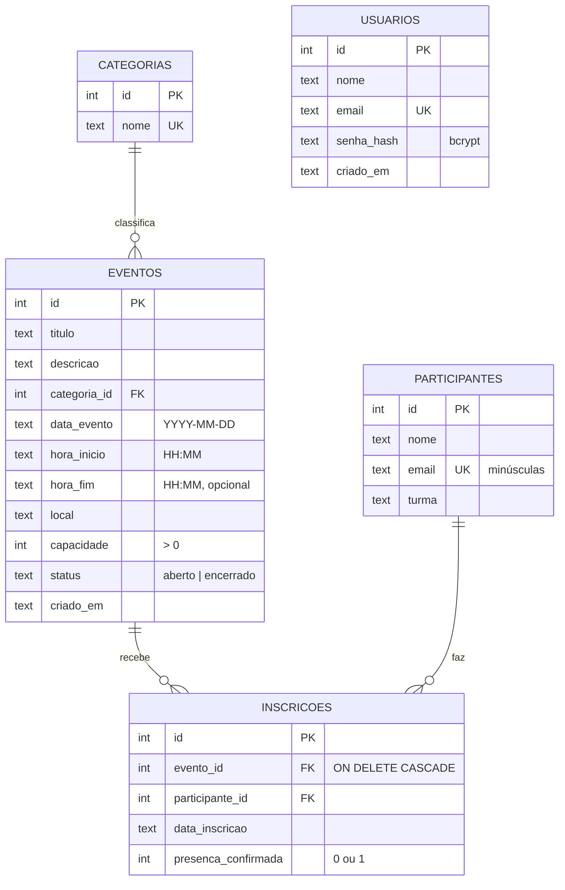

# Arquitetura — Sistema de Eventos Escolares

> Como o sistema é organizado por dentro. Leia antes de criar arquivo, rota ou tabela.
> Regras de negócio: [RULES.md](RULES.md). Requisitos: [PRD.md](PRD.md).

---

## 1. Visão geral

Um único processo Node.js. O servidor monta o HTML (EJS) e devolve pronto para o navegador — não existe front-end separado.

```
 Navegador (aluno no celular / organizador no PC)
     │  HTTP: GET páginas, POST formulários
     ▼
 ┌──────────────────────────── src/server.js (Express) ───────────────────────────┐
 │  static (public/)  →  urlencoded (lê formulário)  →  session  →  res.locals    │
 │                                                                                │
 │   routes/public.js     routes/auth.js     routes/admin.js      routes/api.js   │
 │        │                     │           [requireAuth]        (inscritos:      │
 │        │                     │                 │               requireAuth)    │
 │        ▼                     ▼                 ▼                    ▼          │
 │   ──────────────────── repositories/*Repo.js (todo SQL mora aqui) ──────────── │
 │                                    │                                           │
 │                                 src/db.js  (uma conexão, PRAGMA foreign_keys)  │
 └────────────────────────────────────┼───────────────────────────────────────────┘
                                      ▼
                            data/eventos.db (SQLite)
```

## 2. Camadas: quem pode fazer o quê

| Camada | Arquivos | Faz | **Não** faz |
|---|---|---|---|
| Entrada | `src/server.js` | Configura Express, sessão, estáticos; registra rotas; 404/500 | Regra de negócio, SQL |
| Rotas | `src/routes/*.js` | Lê `req`, valida entrada, aplica as regras (RN), chama repositories, escolhe a view ou redireciona | **SQL** (nunca importa `db.js`) |
| Middlewares | `src/middlewares/requireAuth.js`, `carregarEvento.js` | Barrar quem não está logado; buscar o evento do `:id` (ou 404) | Qualquer outra coisa |
| Validação | `src/validacoes.js` | Limpar e validar dados de formulário (RULES.md §2); `lerId`, `hojeLocal` | Consultar o banco |
| Repositories | `src/repositories/*Repo.js` | Todo o SQL, sempre com `?` (parâmetros) | Ler `req`/`res`, renderizar |
| Banco | `src/db.js`, `src/schema.sql` | Abre conexão, liga FKs, cria tabelas | Consultas de negócio |
| Views | `views/**/*.ejs` | Mostrar dados já prontos | Consultar banco, calcular regra |
| Estilo | `public/css/style.css` | Visual (ver [DESIGN.md](DESIGN.md)) | — |

Regra de ouro: **rota → repository → db**. Se uma rota precisa de um dado novo, cria-se uma função no repository — nunca SQL na rota.

---

## 3. Uma requisição do começo ao fim

Exemplo: aluno envia o formulário de inscrição (`POST /eventos/5/inscrever`).

1. `express.urlencoded` transforma o corpo do formulário em `req.body = { nome, email, turma }`.
2. O middleware `carregarEvento` busca o evento 5 e guarda em `req.evento` (não existe → 404).
3. `validarInscricao(req.body)` (em `validacoes.js`) limpa os campos e normaliza o e-mail (`trim().toLowerCase()`). Se algo falhar → `res.status(422).render('public/inscrever', { erros, valores })` e para aqui.
4. Chama `inscricoesRepo.inscrever(eventoId, dados)`, que roda **numa transação**:
   1. busca o evento — não existe → erro "não encontrado";
   2. evento encerrado ou data passada → erro RN03;
   3. já inscrito neste evento (join com `participantes` pelo e-mail) → erro RN02;
   4. conta inscritos ≥ capacidade → erro RN01;
   5. busca participante pelo e-mail; se não existe, cria;
   6. `INSERT` da inscrição.
   Se mesmo assim a `UNIQUE` do banco barrar, o erro vira a mensagem da RN02.
5. Erro de regra → volta ao formulário com a mensagem (status 409). Sucesso → guarda `req.session.ultimaInscricao` e **redireciona** (`303`) para `/eventos/5/confirmacao`.
6. A confirmação lê a sessão, mostra os dados e apaga `ultimaInscricao`.

A duplicidade é conferida **antes** das vagas: quem já está inscrito num evento lotado recebe "já está inscrito", que é a informação útil para ele.

Padrão usado em todos os formulários: **POST → validação → redirect (PRG)**. Assim o F5 na página seguinte não reenvia o formulário.

---

## 4. Modelo de dados

A fonte da verdade é [`src/schema.sql`](../src/schema.sql). O dicionário de dados completo está no CLAUDE.md, seção 5.2.



`UNIQUE (evento_id, participante_id)` em `inscricoes` impede a mesma pessoa duas vezes no mesmo evento.

### O que o banco garante sozinho (última linha de defesa)

| Garantia | Como | Testado em |
|---|---|---|
| Inscrição duplicada | `UNIQUE (evento_id, participante_id)` + `UNIQUE (email)` | 24/09 ✅ |
| Categoria em uso não some | `ON DELETE RESTRICT` | 24/09 ✅ |
| Excluir evento apaga inscrições | `ON DELETE CASCADE` | 24/09 ✅ |
| Capacidade positiva, status e presença válidos | `CHECK` | — |

Só funcionam porque o `db.js` liga `PRAGMA foreign_keys = ON`.

### Datas e horários

Guardados como texto (`'2026-10-01'`, `'19:00'`). Esse formato ordena certo com `ORDER BY` e compara certo com `>=`. "Hoje" é sempre `date('now', 'localtime')` — sem `localtime`, o SQLite usa UTC (3 h à frente de Brasília). Formatar para `dd/mm/aaaa` só na view, com `formatarData()` / `formatarDataHora()` (definidas em `app.locals` no `server.js`, disponíveis em toda view).

`criado_em` e `data_inscricao` usam `CURRENT_TIMESTAMP`, que grava em **UTC**. Ao ler, converter: `datetime(i.data_inscricao, 'localtime')` (já feito no `inscricoesRepo`).

---

## 5. Mapa de rotas → repository → view

Status: ✅ pronto · ⬜ a fazer.

### Públicas — `routes/public.js`
| | Rota | Repository | View |
|---|---|---|---|
| ✅ | `GET /` | `eventosRepo.listarAbertos(categoriaId)`, `categoriasRepo.listar()` | `public/home` |
| ✅ | `GET /eventos/:id` | `eventosRepo.buscarPorId(id)` | `public/evento` |
| ✅ | `GET /eventos/:id/inscrever` | `eventosRepo.buscarPorId(id)` | `public/inscrever` |
| ✅ | `POST /eventos/:id/inscrever` | `inscricoesRepo.inscrever(eventoId, dados)` | redirect ou `public/inscrever` |
| ✅ | `GET /eventos/:id/confirmacao` | — (lê a sessão) | `public/confirmacao` |

### Autenticação — `routes/auth.js`
| | Rota | Repository | View |
|---|---|---|---|
| ✅ | `GET /admin/login` | — | `admin/login` |
| ✅ | `POST /admin/login` | `usuariosRepo.buscarPorEmail(email)` | redirect ou `admin/login` |
| ✅ | `POST /admin/logout` | — | redirect `/` |

### Painel — `routes/admin.js` (tudo com `requireAuth`)
| | Rota | Repository | View |
|---|---|---|---|
| ✅ | `GET /admin` | `eventosRepo.resumo()`, `eventosRepo.listarAbertos()`, `inscricoesRepo.recentes(8)` | `admin/dashboard` |
| ✅ | `GET /admin/eventos` | `eventosRepo.listarTodos()` | `admin/eventos-lista` |
| ✅ | `GET /admin/eventos/novo` | `categoriasRepo.listar()` | `admin/evento-form` |
| ✅ | `POST /admin/eventos` | `eventosRepo.criar(dados)` | redirect ou `admin/evento-form` |
| ✅ | `GET /admin/eventos/:id/editar` | `eventosRepo.buscarPorId(id)` | `admin/evento-form` |
| ✅ | `POST /admin/eventos/:id` | `eventosRepo.atualizar(id, dados)` | redirect ou `admin/evento-form` |
| ✅ | `POST /admin/eventos/:id/excluir` | `eventosRepo.excluir(id)` | redirect |
| ✅ | `GET /admin/eventos/:id/inscritos` | `inscricoesRepo.listarPorEvento(id)` | `admin/inscritos` |
| ✅ | `POST /admin/inscricoes/:id/presenca` | `inscricoesRepo.alternarPresenca(id)` | redirect `…/inscritos#inscricao-ID` |
| ✅ | `GET /admin/categorias` | `categoriasRepo.listarComTotal()` | `admin/categorias` |
| ✅ | `POST /admin/categorias` | `categoriasRepo.buscarPorNome(nome)`, `categoriasRepo.criar(nome)` | redirect ou `admin/categorias` |
| ✅ | `POST /admin/categorias/:id/excluir` | `categoriasRepo.buscarPorId(id)`, `contarEventos(id)`, `excluir(id)` | redirect |

### API JSON — `routes/api.js`
| | Rota | Repository | Proteção |
|---|---|---|---|
| ✅ | `GET /api/eventos` | `eventosRepo.listarAbertos()` | pública |
| ✅ | `GET /api/eventos/:id` | `eventosRepo.buscarPorId(id)` | pública |
| ✅ | `GET /api/eventos/:id/inscritos` | `inscricoesRepo.listarPorEvento(id)` | `requireAuth` |

Ao criar ou renomear uma função de repository, atualizar esta tabela.

O teste de ponta a ponta usado em 24/09 cobriu todas as linhas acima (60 verificações, todas passando) — ver [MEMORY.md](MEMORY.md).

---

## 6. Sessão

Guardada em memória pelo `express-session` (some quando o servidor reinicia — aceitável para o projeto). Cookie `httpOnly` e `sameSite: 'lax'`.

| Chave | Conteúdo | Quem grava | Quem lê/apaga |
|---|---|---|---|
| `req.session.usuario` | `{ id, nome }` do organizador | `POST /admin/login` | `requireAuth`, header (via `res.locals.usuario`); apagada no logout |
| `req.session.ultimaInscricao` | `{ eventoId, nome, email }` (os dados do evento vêm do banco) | `POST /eventos/:id/inscrever` | `GET /eventos/:id/confirmacao` (apaga depois de mostrar) |
| `req.session.aviso` | `{ tipo: 'sucesso' \| 'erro', texto }` | `avisar(req, tipo, texto)` nas rotas do admin | middleware do `server.js` passa para `res.locals.aviso` e apaga; o `header.ejs` mostra |

O login usa `req.session.regenerate` (id de sessão novo a cada login) e o logout `req.session.destroy`.

Nunca guardar senha nem hash na sessão.

---

## 7. Erros e respostas HTTP

| Situação | Status | O que acontece |
|---|---|---|
| Formulário com campo inválido | `422` | Mesma view, com `erros` e os `valores` digitados |
| Regra de negócio barrou (esgotado, duplicado, encerrado) | `409` | Mesma view, com a mensagem da RN |
| Sucesso de um POST | `303` | Redirect (PRG) |
| Id inexistente ou não numérico | `404` | `public/404` (ou JSON `{ erro }` na API) |
| Não logado em rota protegida | `302` | Redirect para `/admin/login` (na API: `401` com `{ erro }`) |
| Login errado | `401` | `admin/login` com "E-mail ou senha incorretos." |
| Erro inesperado | `500` | `public/erro`; detalhe só no console do servidor |

---

## 8. Decisões técnicas

Registro curto do porquê. Decisões novas vão aqui **e** no [MEMORY.md](MEMORY.md).

| # | Decisão | Por quê | Alternativa descartada |
|---|---|---|---|
| D01 | SQLite com `better-sqlite3` | Nada para instalar; API síncrona é mais fácil de ler e explicar | MySQL (exige servidor), `sqlite3` (callbacks) |
| D02 | EJS renderizado no servidor | Um projeto, um processo, formulários HTML puros | API + React (dobra o trabalho) |
| D03 | `bcryptjs` | Mesma API do `bcrypt` sem compilar no Windows | `bcrypt` (módulo nativo) |
| D04 | Vagas ocupadas = `COUNT(*)`, não uma coluna | Nunca fica dessincronizado | Coluna `vagas_ocupadas` atualizada a cada inscrição |
| D05 | Participante identificado pelo e-mail (`UNIQUE`) | Sem isso a `UNIQUE` de inscrições não pega duplicidade | Novo participante a cada inscrição |
| D06 | Contagem + insert numa transação | Duas pessoas não pegam a última vaga juntas | Checar e inserir separado |
| D07 | Confirmação lida da sessão | Não expõe dados de um aluno trocando o id na URL | `?inscricao=ID` na URL |
| D08 | `/api/eventos/:id/inscritos` exige login | Dados pessoais de menores (LGPD) | Rota pública |
| D09 | Porta padrão 3333 | A 3000 está ocupada por outro projeto na máquina | 3000 |
| D10 | Sem biblioteca de CSRF; cookie `sameSite: 'lax'` | O `lax` já impede outro site de enviar POST com a sessão; menos uma dependência | `csurf` (descontinuado) |
| D11 | Sessão em memória | Um único servidor, sem produção real | Store em SQLite |
| D12 | Validação num módulo próprio (`validacoes.js`), sem biblioteca | Fácil de ler e explicar; mensagens exatas do RULES.md | `express-validator`, `joi` |
| D13 | JavaScript no navegador só para `confirm()` ao excluir (`public/js/confirmar.js`) | Tudo funciona sem JS (RNF04) | Excluir sem pedir confirmação |
| D14 | Seed de demonstração separado (`npm run seed:demo`), só com banco vazio | Nunca mistura dados de teste com dados reais | Dados de teste dentro do `seed.js` |
